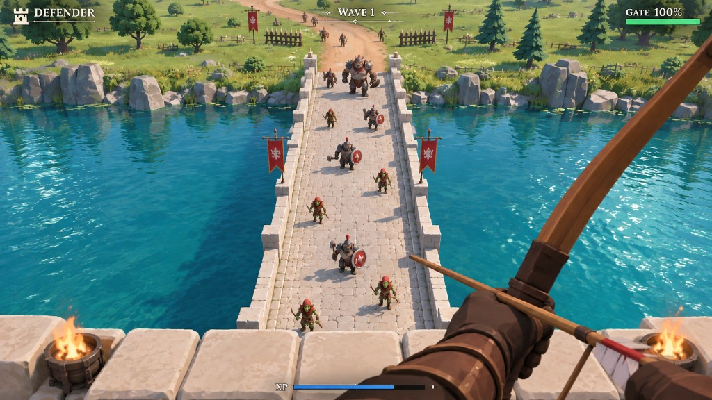
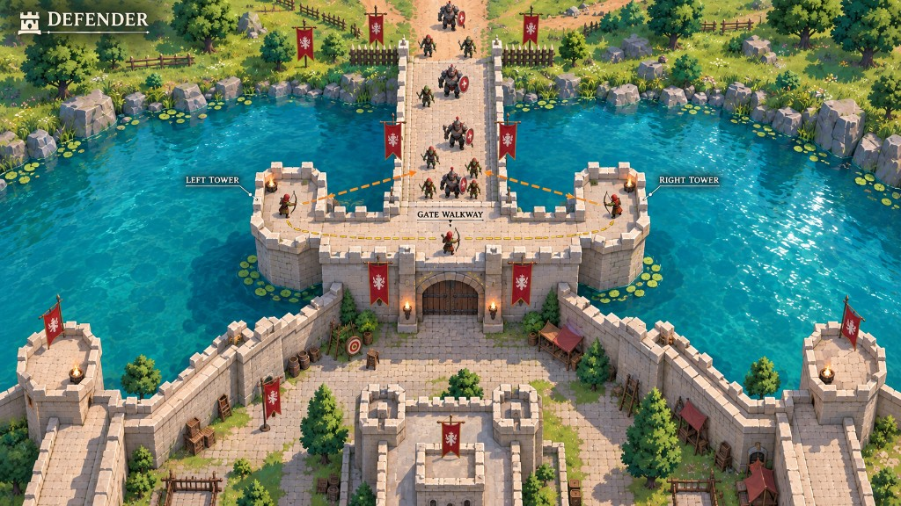
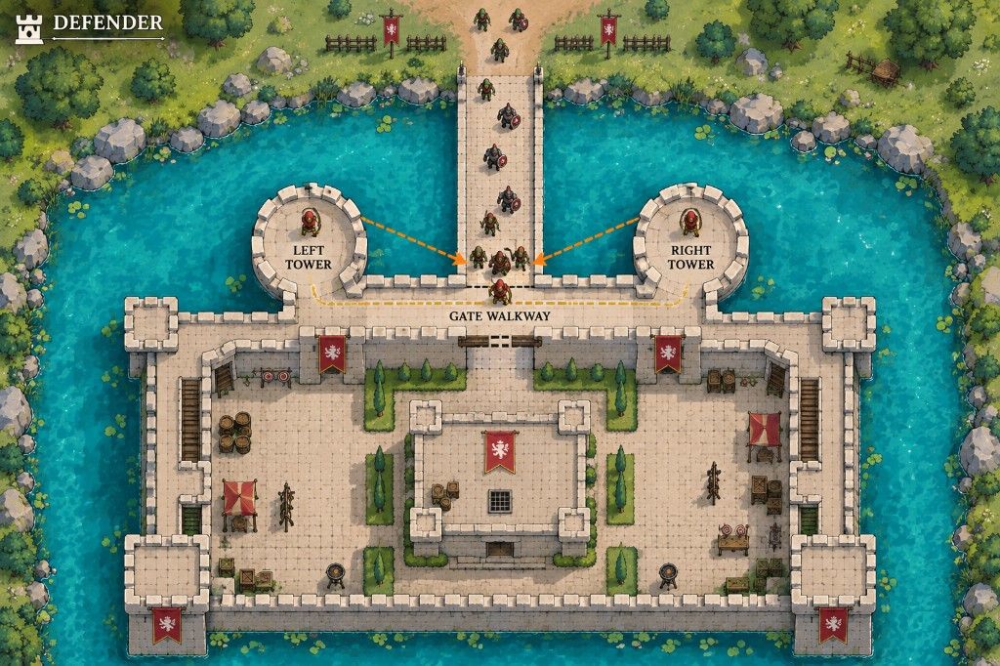

# Defender design

Defender is a first-person archery defense game. You are an archer on the walkway above a castle gate. A stone bridge crosses the moat to your gate, and waves of goblins rush across it to break the gate down. You shoot them before they reach it. The run ends when the gate falls.

This page is the lasting design: what the game is, how it should feel and look, and which layers come next. Numbers live in [tuning.ts](tuning.ts); this page explains intent, not values.

## References

These three paintings are the look and layout target. They are concepts, not specs: they fix the mood, palette, and composition, not the exact controls.

| | |
| --- | --- |
|  | **First person.** The view the game must reach: bow in the lower right, battlements and braziers along the bottom edge, the bridge running straight away from you toward a sunny far bank, goblins readable at every distance. |
|  | **Gate overlook.** The space: a gate walkway between two towers, the bridge meeting the gate, the courtyard behind. |
|  | **Plan.** Layout proportions: the bridge width relative to the walkway, the moat ringing the castle, the courtyard behind the gate. |

## Look

**Target: soft, saturated, illustrated 3D.** Warm sun, cream stone, turquoise water, deep green grass, red banners with cream emblems. Gentle shading, soft shadows, no black ink outlines, no gritty realism. Characters are chunky and readable, with big silhouettes that read at 30 meters.

Rules for every art pass:

- **Read first.** A goblin must read as a goblin from the far end of the bridge. Silhouette and color beat detail.
- **Warm and bright.** The scene is a sunny afternoon. Shadows are soft and colored, never black.
- **Red marks the castle.** Red banners and accents belong to the defenders. Enemies stay green, brown, and iron.
- **Water is turquoise and bright.** It reflects the sky and catches sun glints. It never goes dark or murky.
- **The frame matters.** Battlements along the bottom, the bow in the lower right, the bridge as the central vanishing line. Keep this composition when adding content.

**Current state: illustrated blockout.** Stone, grass, timber, and cloth use painted textures. The moat is bright turquoise with ripples and sun glints. Models are still built from simple shapes: goblins, the bow, and the castle read by silhouette and color, not by sculpted detail.

## Controls

Standard first-person archery. Mouse first; touch works but is not tuned.

| Input | Action |
| --- | --- |
| Mouse | Look and aim (pointer lock) |
| Hold left click | Draw the bow. Draw builds over time. |
| Release left click | Loose the arrow |
| Right click | Ease off without shooting. The arrow stays nocked. |
| WASD or arrow keys | Walk the gate walkway and out onto either tower. Slower while drawing. |
| Q E R F or 1 2 3 4 | Cast the spell in that slot. Slots fill when you pick a spell card. |
| Esc or P | Pause |

A quick tap still fires a weak arrow. After each shot there is a short nock delay before the next draw can start. Ammunition is unlimited.

Looking steeply down leans you out over the battlements, so you can shoot goblins hammering at the gate directly below you.

Touch: drag to look, hold the Draw button to pull, release to loose. No walking.

## Space

- **Walkway.** The top of the curtain wall above the gate. You walk freely inside it. You cannot fall or jump.
- **Towers.** Two open round platforms, one on each side of the gate, at the same height as the walkway and projecting out over the moat beside the bridge. You can walk onto them. From the rim you shoot down at the gate at an angle, which is how you get around shields. The parapet facing the gate is low. The outer rim keeps its merlons.
- **Bridge.** A straight stone bridge, about two walkway widths wide, from the gate to the far bank. Goblins spawn at the far end and spread across its full width.
- **Gate.** A wooden door at the foot of the wall under you. Goblins that reach it stop and strike it.
- **Moat.** Bright water around the castle. Arrows that reach it are lost.
- **Far bank.** Grass, a dirt road, rocks, trees, and fences. Scenery only.
- **Courtyard.** Behind you, so turning around is still a place: enclosing walls, corner towers, a keep, stairs down from the walkway.

## Combat

- **Arrows are physical.** They fly with travel time, gravity, and air drag. Long shots need leading and a little elevation. Draw sets both speed and damage.
- **Arrows stick.** A hit in a goblin, the bridge, a wall, or the ground sticks for a few seconds, then disappears. An arrow stuck in a goblin rides with it. Each arrow hits once.
- **Foes.** All of them stay on the bridge, hold a lane, and never attack the player. Only the gate can fall.
  - **Goblins** walk to the gate and strike it.
  - **Runners** are small and fast, and weave as they come.
  - **Shield bearers** block arrows coming into the front of the shield. A shot from the side or from behind, including from the towers, gets through. Arrows falling steeply from above also get through.
  - **Brutes** are slow, huge, and brutal on the gate.
  - **Casters** stop short of the gate and throw fire at it. Shoot the fire out of the air.
- **Experience and cards.** Kills fill a bar. Levels are spent during the wave break, one card at a time, never mid-wave. Each offer is three cards: a passive, or a spell. You carry up to four spells. A fifth spell replaces the oldest. Passives stack. Taking a spell you already own shortens its cooldown.
- **Gate.** Has health. Each striking goblin wears it down. The gate darkens and shakes as it takes damage. At zero the run ends.

Physics uses Rapier as the collision world: static colliders for every surface, kinematic bodies for goblins. Arrow flight is integrated in code and swept with ray casts each step, which keeps hits exact at any speed and keeps the flight model easy to tune.

## Waves

The run is endless. Each wave sends more foes, with more health, more speed, and shorter gaps between spawns, up to fixed caps. Runners join on wave 2, shield bearers on wave 3, brutes on wave 4, and casters on wave 5. When the last foe of a wave falls, a short break counts down to the next wave. If a level is waiting, the countdown holds while you pick a card. Standing still on wave 1 loses.

Best wave reached is saved in `localStorage`.

The wave break is a real game state. Upgrade choices will happen there.

## States

Ready → Playing → Wave break → Playing … → Game over. Pause can interrupt Playing or Wave break and returns to the same state. Losing pointer lock or hiding the tab pauses the game. Choosing a card releases the mouse on purpose and does not pause.

## Audio

Short synthesized cues: bow release (stronger with draw), hit, death, arrow sticking in stone, gate strike, wave horn, game over. No music yet.

## Built later

These are designed, not built. The current code leaves room for each.

- **Richer models.** Sculpted foes, a modeled bow and hand, banners that move. The painted textures and the water are in place; the meshes are still simple.
- **Win target.** An optional finite run, such as a set number of waves. The current game is endless.

Out of scope: side paths, allied tower archers, enemies swimming or climbing, and enemies attacking the player.

## Code map

| File | Role |
| --- | --- |
| [tuning.ts](tuning.ts) | Every number: layout, player, bow, arrow, foes, waves, gate, spells |
| [rules.ts](rules.ts) | Pure rules: draw, standing room, shields, waves, experience, gate damage |
| [cards.ts](cards.ts) | Passives, spells, the deal, and the modifiers a run is carrying |
| [castle.ts](castle.ts) | Castle, bridge, moat, banks, courtyard, towers, lights, colliders |
| [look.ts](look.ts) | Painted textures and the moat shader |
| [goblin.ts](goblin.ts) | Foe rigs: goblin, runner, brute, shield bearer, caster |
| [bow.ts](bow.ts) | First-person bow and the shared arrow mesh |
| [world.ts](world.ts) | Rapier world, arrow flight, foe steering, spells, player movement, rendering |
| [audio.ts](audio.ts) | Synthesized sound cues |
| [game.ts](game.ts) | Game states, input, pointer lock, waves, cards, gate, HUD |

`npm run test:defender` covers the pure rules.
